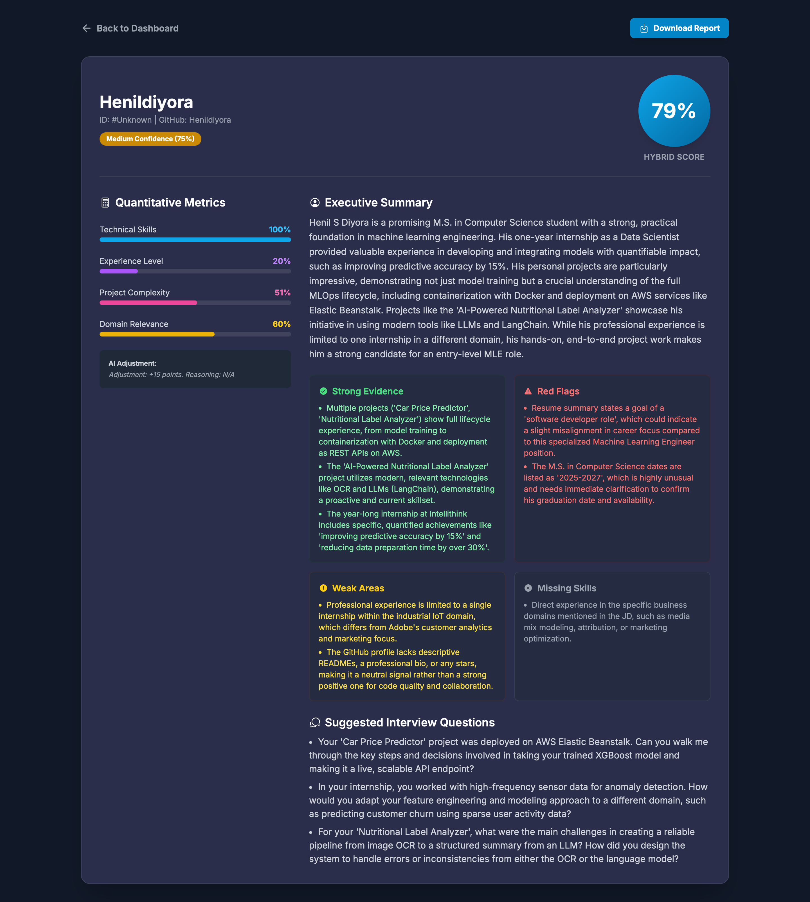

AI Candidate Screener

An intelligent, evidence-based hiring platform for technical recruiters. This tool goes beyond simple keyword matching by using a Hybrid Scoring Engine that combines objective quantitative metrics with qualitative AI analysis to generate defensible, explainable candidate reports.

It analyzes a candidate's GitHub profile, Resume (PDF), and LinkedIn profile (PDF) against a specific Job Description to determine fit.

## Application Screenshots

1.  **UI Dashboard**
    

2.  **Project Dashboard**
    

3.  **Hybrid Analysis Report**
    

## How It Works: The Hybrid Scoring Engine

This application implements a sophisticated Quantitative + Qualitative architecture. It doesn't just ask an AI "is this person good?" Instead, it runs a multi-step pipeline to verify claims and calculate a defensible score.

### Phase 1: Quantitative Analysis (The Math)

Before any AI is involved, the system runs 4 deterministic Python modules to calculate a Base Score (0-100) based on hard data:

*   **Technical Skills Match (40% Weight):**

    *   **Logic:** Extracts key technical terms from the JD and compares them against the unique set of skills found in the Resume and GitHub Repos.
    *   **Goal:** Measures raw keyword alignment.

*   **Experience Level (25% Weight):**

    *   **Logic:** Parses years of experience from the Resume and analyzes the timeline of GitHub activity.
    *   **Goal:** Ensures the candidate meets seniority requirements.

*   **Project Complexity (20% Weight):**

    *   **Logic:** Analyzes GitHub repositories for indicators of engineering depth: repository size, star count, language diversity, and documentation quality (README existence).
    *   **Goal:** Distinguishes "tutorial followers" from engineers building real software.

*   **Domain Relevance (15% Weight):**

    *   **Logic:** extracts domain-specific jargon (e.g., "FinTech", "Healthcare", "Computer Vision") from the JD and scans for their presence in the candidate's profile.
    *   **Goal:** Checks for industry-specific knowledge.

### Phase 2: Qualitative Analysis (The AI)

The raw data and the calculated quantitative metrics are sent to Google Gemini 2.5 Pro. The AI acts as a "Senior Technical Recruiter" to perform Explainable AI (XAI) analysis:

*   **Contextual Review:** It reads the Resume and GitHub READMEs to understand how skills were applied, not just if they were listed.

*   **Score Adjustment:** The AI provides a specific Adjustment Score (-20 to +20 points).

    *   **Positive Adjustment:** Awarded for "Hidden Gems" (e.g., impressive projects that use different keywords than the JD but show transferable skills).

    *   **Negative Adjustment:** Applied for "Red Flags" (e.g., resume fluff, claims of expertise with no GitHub evidence).

*   **Evidence Generation:** It generates lists of Strong Evidence, Weak Areas, and Missing Skills to justify its reasoning.

### Phase 3: The Final Blended Score

The system combines the math and the AI judgment into a final result:

$$\text{Final Score} = (\text{Base Quantitative Score}) + (\text{AI Adjustment})$$

*   **High Confidence:** If the Math and AI agree.

*   **Low Confidence:** If the AI significantly disagrees with the Math (flagging a potential anomaly for human review).

## Key Features

*   **Dashboard Interface:** A professional sidebar navigation to manage multiple job descriptions ("Projects") and their respective candidate pools.

*   **Search & Sort:** Instantly filter candidates by name, ID, or Fit Score to find top talent.

*   **Evidence-Based Reporting:** Every score is backed by specific evidence (e.g., "Claimed Python expert but has 0 Python repos").

*   **PDF Export:** Generate a single PDF that combines the AI analysis, the original Resume, and the LinkedIn profile into one document.

*   **Smart Caching:** Analysis results are hashed and cached. Re-opening a candidate's report is instant and costs $0 in API fees.

## Tech Stack

*   **Backend:** Python, FastAPI, SQLModel (SQLite)
*   **Frontend:** HTML5, Tailwind CSS, Vanilla JavaScript
*   **AI Model:** Google Gemini 2.5 Pro
*   **Data Processing:** pypdf (PDF Parsing), fpdf2 (PDF Generation), httpx (Async API)

## Setup & Installation

1.  **Clone the repository:**
    ```bash
    git clone <repository-url>
    cd AI_GitHub_Profile_Summarizer
    ```

2.  **Create a virtual environment:**
    ```bash
    python3 -m venv github_summarizer_venv
    source github_summarizer_venv/bin/activate
    ```

3.  **Install dependencies:**
    ```bash
    pip install -r requirements.txt
    ```

4.  **Configure Environment Variables:**
    Create a `.env` file in the root directory:
    ```env
    GITHUB_TOKEN="your_github_personal_access_token"
    GEMINI_API_KEY="your_google_gemini_api_key"
    ```

5.  **Initialize the Database & Run:**
    ```bash
    # This will automatically create the database.db file
    uvicorn main:app --reload
    ```

6.  **Access the Dashboard:**
    Open `http://127.0.0.1:8000` in your browser.